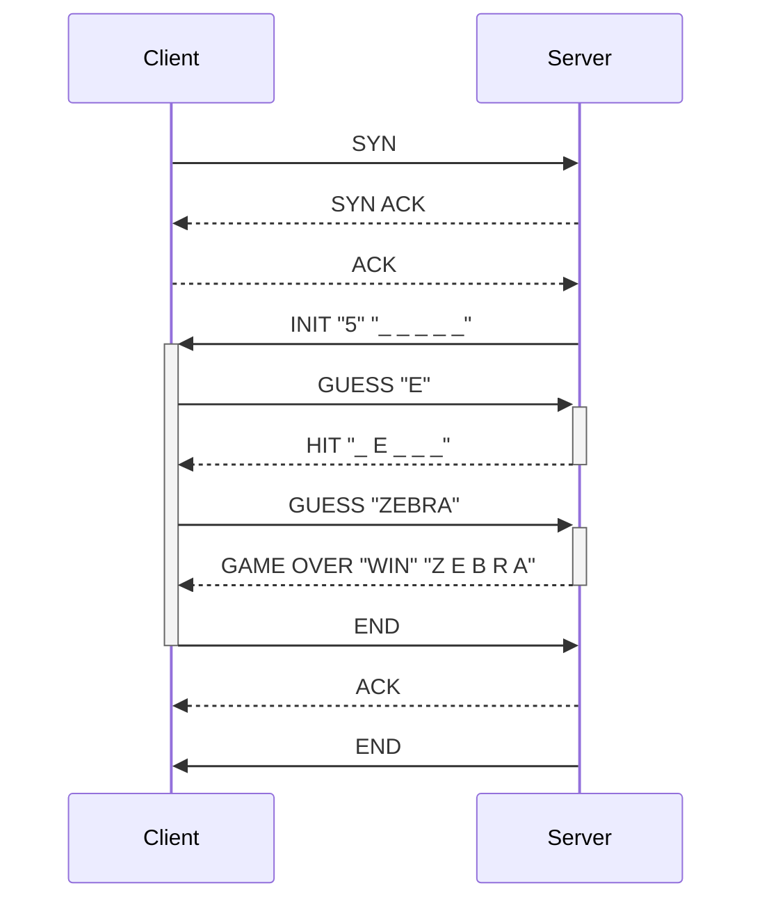
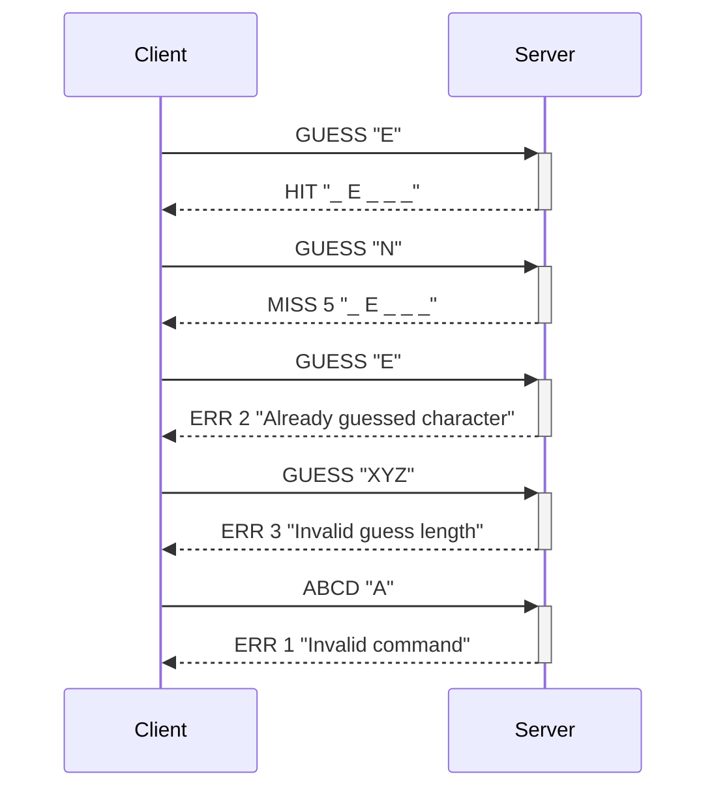
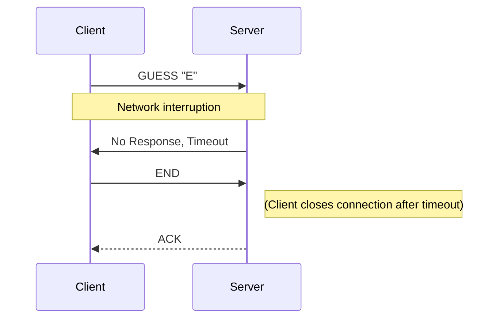

# DAI-2023-24-Practical-work-2-TCP

* Lucas Lattion
* Romain Humair

# A Hangman Game CLI

## How to use the CLI

minimum parameter is client or server mode

cmd
```
java -jar hangmanGame-1.0-SNAPSHOT.jar
```
result
```
Please specify either --server or --client option.
```

Client mode can be selected with option `-c` or `--client`. You can also select the port (`-p, --port=<port>`) and ip (`-i, --ip=<serverIp>`) options

Server mode can be selected with option `-s` or `--server`. You can also select the port (`-p, --port=<port>`) and max thread (`-t, --thread=<maxThread>`) options

Default values :
* port is defined by the application protocole and is set to `9795`
* ip is `localhost`
* pool thread is `2`


## Help
cmd
```
java -jar hangmanGame-1.0-SNAPSHOT.jar -h
```
result
```
Usage: hangman game [-chsV] [-i=<serverIp>] [-p=<port>] [-t=<maxThread>]
                    [COMMAND]
Play the hangman game
  -c, --client               Run as TCP client
  -h, --help                 Show this help message and exit.
  -i, --ip=<serverIp>        Server IP address (default : localhost)
  -p, --port=<port>          Port number (default : 9795)
  -s, --server               Run as TCP server
  -t, --thread=<maxThread>   Server pool thread (default : 2)
  -V, --version              Print version information and exit.
Commands:
  help  Display help information about the specified command.
```


## Examples

Server : ```java -jar hangmanGame-1.0-SNAPSHOT.jar -s```
```
Starting TCP server on port 9795 with pool thread of 2
Hangman Server is listening on port 9795 with a pool thread of 2
```

Client : ```java -jar hangmanGame-1.0-SNAPSHOT.jar -c```
```
Starting TCP client and connecting to localhost:9795
Connected to Hangman Server
Server: INIT _______ 7
Enter your guess (single letter or whole word):
```


# Hangman Game TCP Protocol Specification

## Section 1 - Overview

This document specifies the application protocol for a Hangman game played over a network using TCP/IP. The game involves a client, which is the player guessing the word, and a server, which manages the game logic and validates the guesses.

## Section 2 - Transport Protocol

- **Protocol**: TCP/IP
- **Port**: The server listens on port **9795** for incoming connections (The port is link to our birth year 1997 and 1995. The port is not commonly used by other services).
- **Connection**: The client initiates the TCP connection to the server. The connection must be established with a TCP three-way handshake before any game data is exchanged.
- **Session**: The server maintains session state for each connected client. This includes the current word, guesses made, and number of attempts left.

## Section 3 - Messages

### Connection Setup
- `SYN` (Client -> Server): Begin connection.
- `SYN-ACK` (Server -> Client): Acknowledge connection request.
- `ACK` (Client -> Server): Finalize connection establishment.

### Game Initialization
- `INIT <hiden word>` (Server -> Client): Welcome message including the length of the word and initial display (e.g., "_ _ _ _ _").

by default Server support up to 2 simultaneous clients. Can be changed with the CLI and option -t --thread. See section CLI help for more informations

### Guessing
- `GUESS <letter or word>` (Client -> Server): The client's guess.
- ~~`RESPONSE <status>` (Server -> Client): The server's response to the guess, where `<status>` includes the updated word display, remaining attempts, and any error/success codes.~~
- `HIT <hiden word>` (Server -> Client): the guess was correct. The letter has been added to the hidden word (e.g., "_ A _ _ _").
- `MISS <attempts left> <hiden word>` (Server -> Client): the guess was incorrect. Attempts left was decreased (e.g., 6 "_ _ _ _ _")

### Game End
- `GAME OVER <result>` (Server -> Client): Final game status, indicating win/loss and the correct word.

### Connection Teardown
- `END` (Client -> Server or Server -> Client): Initiate connection teardown.
- `ACK` (Server -> Client or Client -> Server): Acknowledge FIN.

### Error Handling
- `ERR <code>` (Server -> Client): Error message with specific code explaining the error.

#### Error Code Definitions
- `1`: Invalid command.
- `2`: Already guessed character.
- `3`: Invalid guess length.

## Section 4 - Examples

### Successful Guess Sequence




## Section 5 - Protocol Diagrams

### Successful Connection and Guess
[Described in the Example section]

### Error Handling




### Malformed Message Format

The server responds with an error code indicating an invalid character when it receives a malformed guess message. This prevents any further processing of an invalid request.

Implementing these protocols and edge-case management ensures a robust and user-friendly Hangman game experience over a TCP/IP connection.


## Edge Cases

Edge cases could include network interruptions, client disconnections, and malformed message formats. Each case should be handled gracefully, with the server providing an appropriate error code and message to the client, or by timing out the connection after a certain period of inactivity.

### Network Interruption



In this diagram, the client sends a guess but experiences a network interruption that prevents the server's response. After a timeout, the client will close the connection.


## Tool used
- Maven
- Java 17
- Intellij IDEA Ultimate
- GitHub
- Markdown
- ChatGpt
